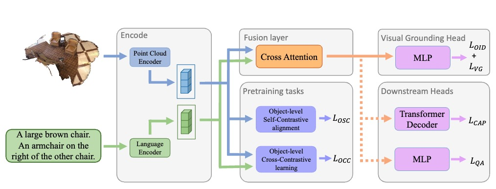

# Vision-Language Pre-training with Object Contrastive Learning for 3D Scene Understanding

### [[Paper](https://arxiv.org/abs/2305.10714)] 


[Taolin Zhang](https://scholar.google.com/citations?user=DWnu_G0AAAAJ)\*,  [Sunan He](https://scholar.google.com/citations?user=1DFuPZoAAAAJ&hl=zh-CN)\*, [Tao Dai](https://scholar.google.com/citations?user=MqJNdaAAAAAJ&hl=zh-CN), [Bin Chen](https://scholar.google.com.hk/citations?user=Yl0wv7AAAAAJ&hl=zh-CN), [Zhi Wang](https://scholar.google.com.hk/citations?user=PK8BtpwAAAAJ&hl=zh-CN) and [Shu-Tao Xia](https://scholar.google.com/citations?user=koAXTXgAAAAJ)

> **Abstract:**  In recent years, vision language pre-training frameworks have made significant progress in natural language processing and computer vision, achieving remarkable performance improvement on various downstream tasks. However, when extended to point cloud data, existing works mainly focus on building task-specific models, and fail to extract universal 3D vision-language embedding that generalize well. We carefully investigate three common tasks in semantic 3D scene understanding, and derive key insights into the development of a pre-training model. Motivated by these observations, we propose a vision-language pre-training framework 3DVLP (3D vision-language pre-training with object contrastive learning), which transfers flexibly on 3D vision-language downstream tasks. 3DVLP takes visual grounding as the proxy task and introduces Object-level IoU-guided Detection (OID) loss to obtain high-quality proposals in the scene. Moreover, we design Object-level Cross-Contrastive alignment (OCC) task and Object-level Self-Contrastive learning (OSC) task to align the objects with descriptions and distinguish different objects in the scene, respectively. Extensive experiments verify the excellent performance of 3DVLP on three 3D vision-language tasks, reflecting its superiority in semantic 3D scene understanding.


<p align="center">
    
</p>


## <a name="installation"></a> Installation

This codebase was tested with the following environment configurations. It may work with other versions.

- Python 3.9
- CUDA 11.1
- PyTorch 1.9.0 + cu111

## Datasets
Please follow [3DVL_Codebase](https://github.com/zlccccc/3DVL_Codebase) to download the ScanRefer and Scan2Cap datasets and [ScanQA](https://github.com/ATR-DBI/ScanQA) to download the ScanQA dataset. 


## <a name="training"></a>  Running

Run the following script to run 3DVLP:
```
bash run.sh
```


## <a name="cite"></a> Citation

Please cite us if our work is useful for your research.

```
@inproceedings{zhang2024vision,
  title={Vision-Language Pre-training with Object Contrastive Learning for 3D Scene Understanding},
  author={Zhang, Taolin and He, Sunan and Dai, Tao and Wang, Zhi and Chen, Bin and Xia, Shu-Tao},
  booktitle={Proceedings of the AAAI Conference on Artificial Intelligence},
  volume={38},
  number={7},
  pages={7296--7304},
  year={2024}
}
```

## License

This project is released under the [MIT license](LICENSE).

## Acknowledgement

This code is based on [3DVL_Codebase](https://github.com/zlccccc/3DVL_Codebase). Thanks for their awesome work.

## Contact

If you have any questions, feel free to approach me at zhangtlin3@gmail.com.
